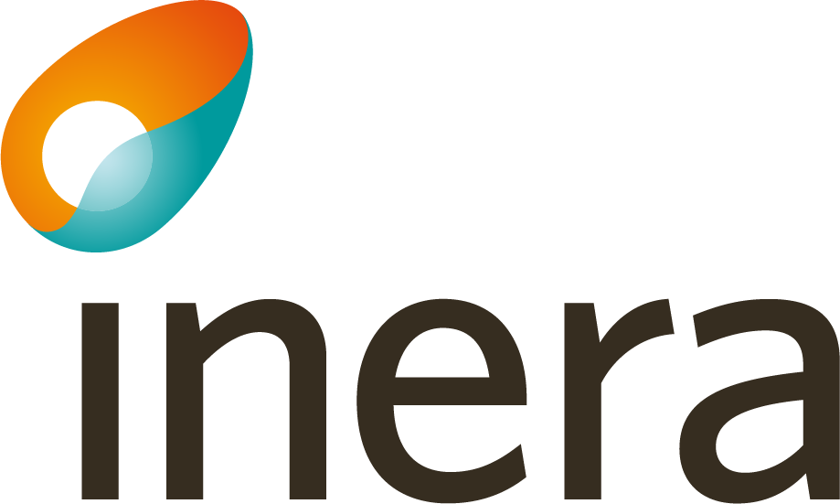

# Välkommen till eKlients GitHub sidor

eKlient är ett koncept som bygger på ett samarbete mellan regioner och kommuner och andra offentliga verksamheter inom Sverige. Syftet är att tillsammans ta fram gemensamma riktlinjer, samt att utveckla verktyg och tekniska lösningar för att få en så effektiv, säker och automatisk hantering av den digitala arbetsplatsen som möjligt.

Dessa sidor fungerar som ett komplement till våra officiella sidor som nås på [Inera.se/eKlient](https://inera.se/eKlient)

## Dokument

Nedan finns de publika dokument som producerats av eKlient för nedladdning

### Stödjande
I dokument Kravbibliotek kan du läsa om de krav som gäller för att system, applikationer eller andra it-komponenter ska kunna använda E-klient som plattform.
* [E-klient - Kravbibliotek (Dokument)](/docs/eklient_kravbibliotek.pdf)  
*Gäller från 2020-03-16*

### Standarder
Gemensamma standarder ger vägledning och rekommendationer för konfiguration med hög tillgänglighet, användarvänlighet och it-säkerhet.
* [E-klient - Hantering av klienter med mjukvara som gått End-Of-Life (Pdf)](/docs/eklient_hantering_av_klienter_med_mjukvara_som_gatt_end_of_life.pdf)  
*Gäller från 2019-02-06*
* [E-klient standard Mobila enheter och applikationer (Pdf))](/docs/e-klient_standard_mobila_enheter_och_appar.pdf)  
*Gäller från 2017-10-04*

### Regelverk och policys
* [Paketeringspolicy E-klient (Pdf)](/docs/paketeringspolicy_eklient.pdf)  
*Gäller från 2020-05-05*

### Presentationer
* [Vad är E-klient? (Pdf)](/docs/vad_ar_e-klient_svenska.pdf)  
*Gäller från 2019-12-06*
* [What is E-klient? (Pdf)](/docs/what_is_e-klient_english.pdf)  
*Gäller från 2019-12-06*

### Kontakta oss för mer information
För övriga kontaktuppgifter se [Inera.se/eKlient](https://inera.se/eKlient)

***
  
###### eKlient är en av många tjänster som tillhandahålls av Inera. För mer information se [Inera.se](https://inera.se)

